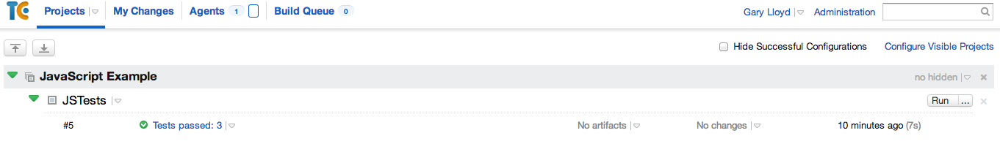

# JavaScript testing example

## Introduction

With the rise of rich web applications JavaScripts has become a very commonly used  technology. Unfortunately, due to the nature of JavaScript being primarily a client side technology it has been somewhat ignored for a long time when it comes to good engineering practice. Over the last couple of years, with the rise of the modern JavaScript engines and technologies such as Node.js this trend has changed and there are now a large number of tools to facilitate development of clean, well tested code.

Client-side JavaScript is event driven. The user interacts with a component on the screen (e.g. by clicking a button), the application executes some actions and shows some new or additional information to the user. All too often it is the case that these event handlers are overloaded with responsibilities. We find data manipulation, DOM transformations and server communication via AJAX calls all merged together. There are two issues with this sort of code:

* The code can only be tested as a black box. For web applications this means acceptance tests at the browser level. These browser based tests can have a lot of value when used to test specific application scenarios but since they tend to be slow and brittle are a poor way to test isolated areas of functionality (e.g. validation rules in a form)

* Code crystallisation - when the different responsibilities are all entangled without a clear design it is very difficult to evolve and add new functionality. This leads to duplications and often more unnecessary complexity.

This code example aims to take a simple example of a login page and to separate the JavaScript into testable components. The example has been taken from the excellent article "Take Your JavaScript for a Test Drive" in the second ThoughtWorks Anthology. The intention was to provide a simple solution that shows all of the required components and how they can be hooked together either to run tests at the command line or in a continuous integration server (TeamCity has been targeted in this example). Key to this is the use of a headless JavaScript execution environment and PhantomJS is used for this.

A extension will include the use of Grunt to automatically run the tests every time a file is modified.

## Original Code

In the `original` folder is a simple web page that provides a login form. The `index.html` page contains only four elements and the JavaScript in `originalPage.js` that backs it provides a simple JavaScript function to perform basic validation, pass the values for user name and password to an AJAX call and handle the response. 

Despite being easy to read, even this simple example is enough to immediately highlight the issues described above. The code is a muddle of business logic and presentation, there are duplicated code blocks and it is difficult to see how it could be tested without setting up a full HTML test fixture. If the validation logic became a little bit more complex then it is clear that this code will become very difficult to maintain.

## Abstraction

The solution to this problem is the same as it would be for any other programming language. Separate the concerns into different modules that collaborate to achieve the specific functionality that we require. By separating into different components that have different areas of responsibility we give ourselves the opportunity to use standard unit testing techniques such as mocking enabling us to test the application without the need for a complex HTML test fixture.

The article this example is drawn from details how this can be abstracted into three different areas of responsibility:

* *Presentation* - Responsible for how we display the application to the user. In this particular case the messages and how they are presented.

* *HTTP* - Responsible for integration with the server. In this case managing the AJAX calls required.

* *Application Logic* - This is the code at the core of our application. In this case the validation rules being applied and controlling what we do based on user input.

## Refactored Example

Given the abstractions from the previous section the original example can be refactored into the form shown in the `reworked/src` folder. Here the `loginPageLogic.js` contains the application logic while the interactions with the server and the UI have been pushed into `authenticationService.js` and `loginPageView.js` respectively.

With the code now nicely separated out it is possible to consider writing unit tests for it.

## Automated Tests

There are now numerous testing frameworks available for JavaScript. The goal of this example was to select one that was well supported and provided the ability to run both in a browser and also headless from the command line to allow a continuous integration server to execute the tests. Jasmine (https://jasmine.github.io/) was selected.

The tests are defined in the JavaScript files in the +Spec+ folder and to execute them you simply need to open the `HTMLTestRunner.html` file in a browser. If everything works you should see a page with a banner message that says "Passing 3 specs". The intention is not to be a Jasmine tutorial so I leave it to the reader to follow the examples on the Jasmine site.

Note: One of the tests fails in chrome since the page is being loaded from the file system so best to use Safari or IE accordingly. Don't worry, this isn't how you'll be running them after this initial look.

## Running on the command line

While being a nice way to view the result of a JavaScript test run, loading an HTML page isn't possible on a CI server so we need to be able to run our tests on the command line. In order to achieve this we need a headless JavaScript execution environment and this is where PhantomJS (http://phantomjs.org/) comes in.

In order to run the tests on the command line you will need to download PhantomJS and ensure that the `phantomjs` binary is on your path. On Windows, since it doesn't support ansi colours by default you should also unpack ansicon from the `ext` directory and run this prior to any test runs. If you don't you'll see some strange characters in the text written the to console. If you don't want to use ansicon then an alternative would be to edit the `console_reported.js` file in `libtest\jasmine-reporters` to remove the ansi encoding.

Once everything is configured, you should be able to execute the tests by running the `runtests` script appropriate to your platform. The output should show successful test execution. At this point you may want to edit an assertion to cause a test to fail so you can see how this gets reported.

## Running on TeamCity

TeamCity provides the ability to integrate any test system it doesn't provide support for by providing a framework to allow the user to write messages in a specified format to the log which it will interpret as test start/end. This means that by providing a different Jasmine test running that writes this sort of message we can easily integrate with TeamCity.

In the `TestRunner.html` file edit the reporter that is being used by uncommenting the TeamCityReporter.

	//Select the type of runner required
	jasmine.getEnv().addReporter(new jasmine.TeamcityReporter());
	//jasmine.getEnv().addReporter(new jasmine.ConsoleReporter());

If you run again from the command line you will see messages in TeamCity format like:

	##teamcity[testSuiteStarted name='Login Page']

All that you need to do now is configure a TeamCity configuration to execute the command line script in the same way as you would any other system process.

Given the log messages are written in TeamCity format they will be recognised as tests and you should see the usual sort of build reports.

